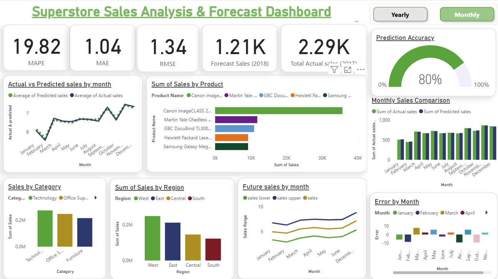
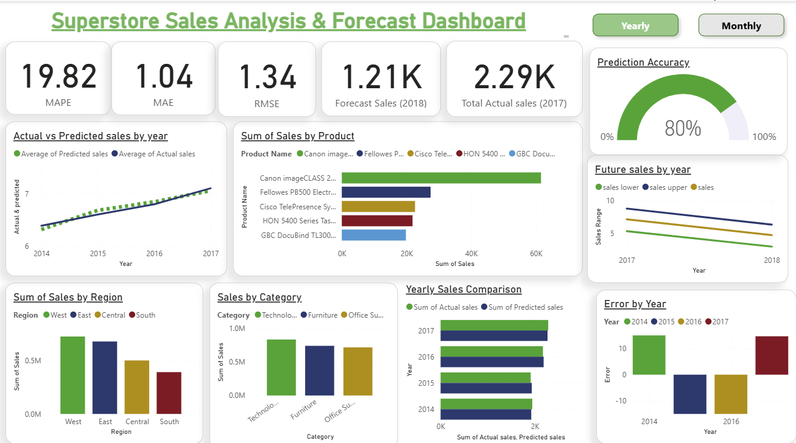

# 📊 Sales Forecasting Dashboard  

This project was completed as part of my **Machine Learning Internship at Future Interns**. The main goal was to **forecast sales trends** and create an **interactive dashboard** to generate actionable business insights.  

## 🚀 Project Summary  
- Built a **time series forecasting model** using **Facebook Prophet**  
- Visualized trends, KPIs, and forecasts using **Power BI**  
- Analyzed historical sales data to predict future performance  
- Evaluated the forecasting model using **MAE, RMSE, and MAPE**  

## 📂 Key Features  
- ✅ Forecast daily sales with **confidence intervals**  
- ✅ Compare **Actual vs Forecasted sales trends**  
- ✅ KPI cards for **Actual & Predicted Sales**  
- ✅ Residual analysis for error tracking  
- ✅ Insights at **category and sub-category levels**  
- ✅ Fully **interactive dashboard** with filters  

## 🛠️ Technology Stack  
- **Python**: Pandas, Prophet, NumPy, Matplotlib  
- **Power BI**: Data visualization & KPI dashboards  

## 📈 Model Evaluation  
- **MAE:** 1.04  
- **RMSE:** 1.34  
- **MAPE:** 19.82%  
- Integrated a **Prediction Accuracy Gauge** in Power BI  

## 📸 Dashboard Preview  

### Monthly Trends  
  

### Yearly Trends  
  

## 🔗 Resources  
- 📂 [Dataset](https://www.kaggle.com/datasets/vivek468/superstore-dataset-final)  
- 💻 [Code Notebook](https://colab.research.google.com/drive/1yJr0z0XoNETChb4C5GRnP2IUq8OP8dxz?usp=sharing)  
- 📊 [Power BI Dashboard](https://github.com/vivek-boini/FUTURE_ML_01/blob/main/ML-task1.pbix)  

## 🏆 Internship Task  
This project is **Task 1** of my internship at **Future Interns**, focusing on **Machine Learning and Time Series Forecasting**.  
